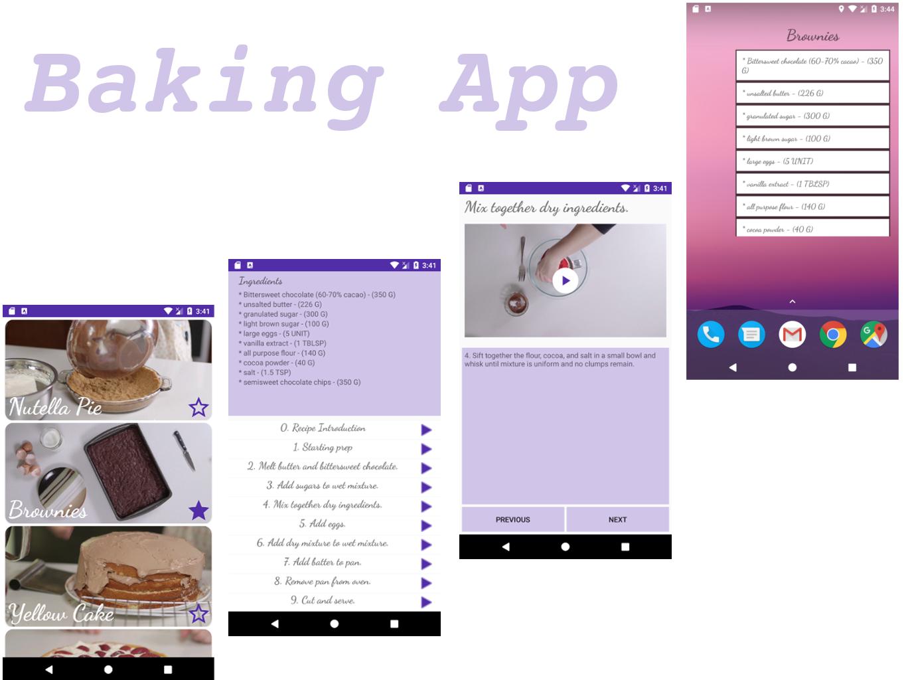
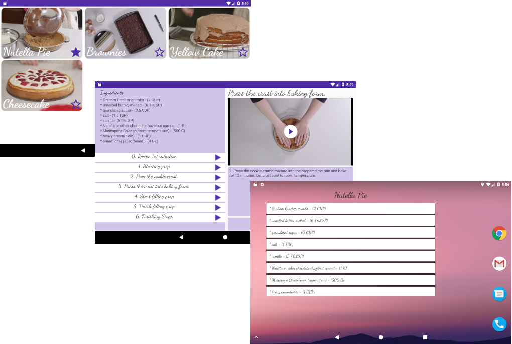

# Baking App
The Baking App is an app to get information from different dishes and show to the user (Mobile and Tablet) and it is part of Udacity program.

## Used Libraries
* Dagger 2
* Gson
* Glide
* Mockito
* Espresso
* OkHttp
* Room
* Constraint Layout
* Recycler View
* ExoPlayer
* CardView

## OverView
This App shows information about different dishes. For each dish, the app helps user with by making available steps and ingredients. Some of those steps are illustrated and other ones reproduce a video.

Furthermore, the user can add his/her favorite recipe on HomeScreen using android widgets in order to see the recipe ingredients.

## Code Structure
The code was written using MvP with Clean Architecture and the tests were written using Espresso and Junit.

## Screenshots

### Phone

### Tablet

